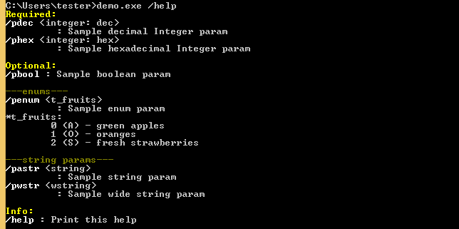
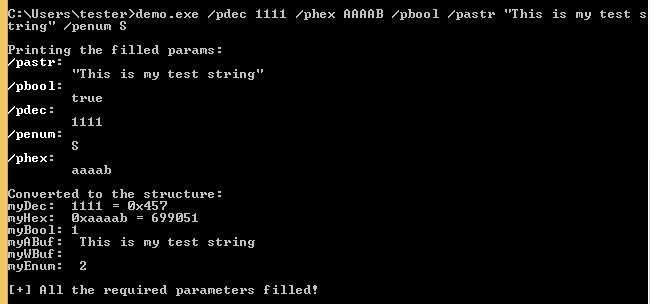

# ParamKit
A small library helping to parse commandline parameters (for Windows).

Demo
-
Print help for each parameter:

Easily store values of popular types, and verify if all required parameters are filled:

See [the demo code](https://github.com/hasherezade/paramkit/tree/master/demo)
